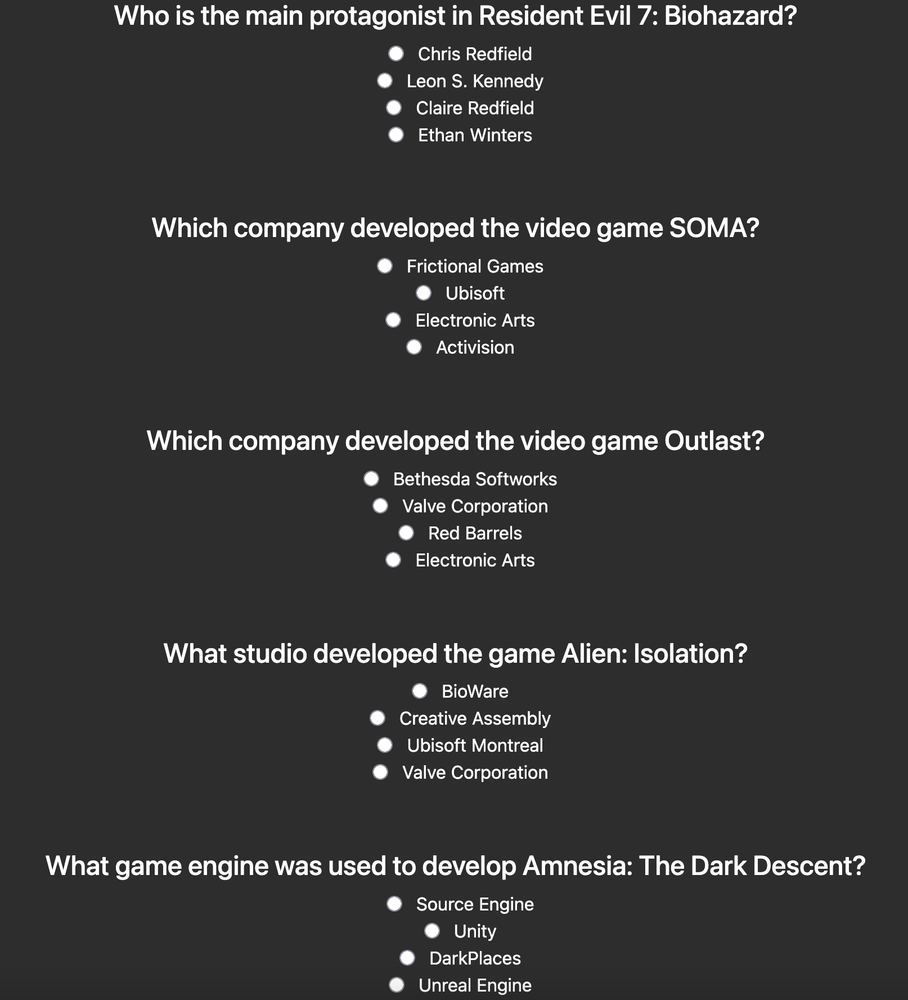
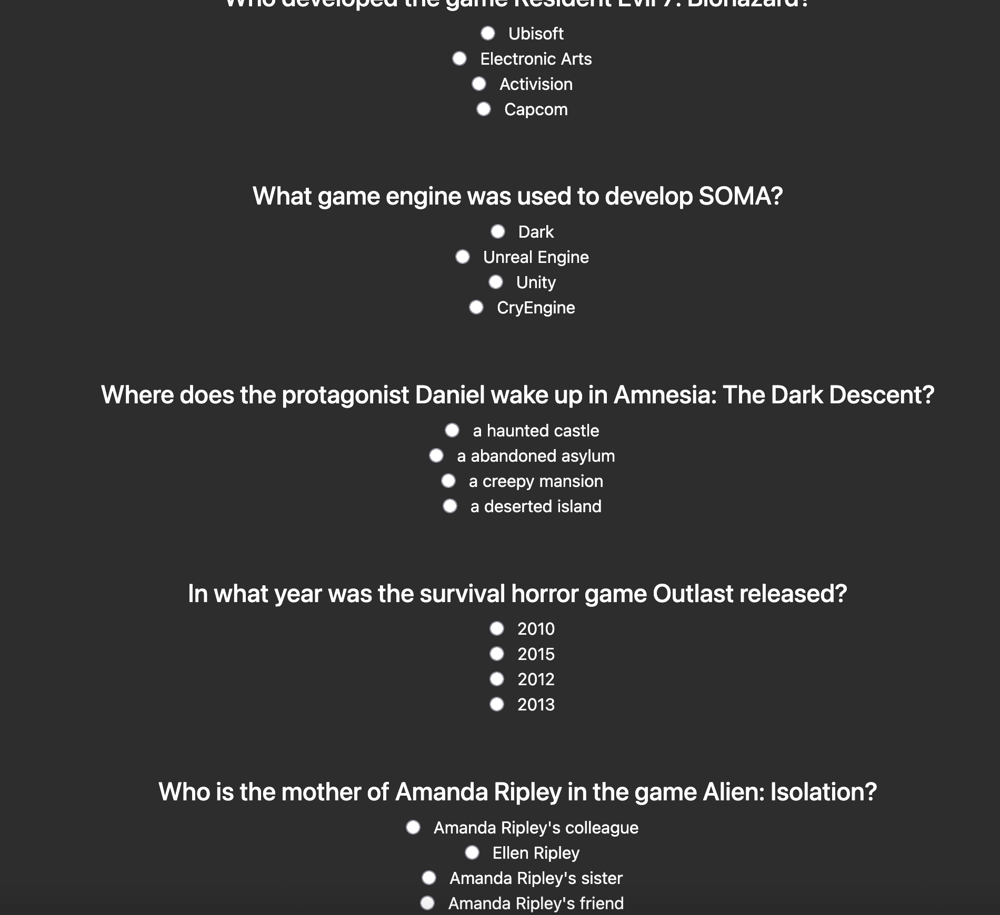

**Trivai**

Trivai is an LLM-powered trivia application that generates trivia questions based on user-selected media types and genres. The application leverages a modern Express.js backend and a custom single-page application (SPA) frontend. For the LLM service, Groq is used - specifically with the moodel meta-llama/llama-4-scout.

**Setup Instructions**
Prerequisites
Node.js (v14 or higher)
npm (v6 or higher)

**Installation**

- Clone the repository:
```
git clone <repository-url>
cd trivai
```
- Install dependencies:
```
npm install
```
- Configure environment variables:
Create a .env file in the root directory.
Add the following variables:
```
PORT = [port goes here]
KEY=[api key here]
```
You can get an API key from https://console.groq.com.
 - Run the application:
```
npm run dev
```

The server will start and listen on the port specified in .env.

 - Access the application:

Open your browser and navigate to http://localhost:[port goes here].

Notes
The backend communicates with an LLM API (Groq) to generate trivia content. Ensure your API key is valid and has sufficient quota.
The frontend is a custom SPA and does not use frameworks like React or Vue.
For development, static files are served from the public/ directory.

**Analysis/Interpretation**

Trivai as a proof of concept is a great success. That being said, the limitations are clear, and further intervention would be required to make this a full experience. 

Limitation #1: Lack of variety

Groq works well for getting something up and running, but it tends to provide the same response every time, making repeat questions common. To illustrate this point, here is a side by side comparison of Trivai with the configuration { media: "game", genre: "horror" }:

 

As you can see, Groq generates the exact same five games. Almost all of the difference comes from the fact that Trivai manually selects random attributes to query Groq for a question, rather than relying on Groq to select random attributes. One work around is to request more games than needed and randomly pick a subset for generating quesitons, though this would be more costly long-term. 

Limitation #2: Unpredictable question quality

Another limitation of Groq is highlighted here. Most questions are generic and fairly easy to guess by seeing what attribute is common for three of the four answers. Example: What game studio developed Dishonored? A. Valve Industries, B. Blizzard Entertainment, C. Arkane Studios, D. Electronic Arts. The obvious answer here is Arkane Studios - but not because of the fact of the matter. Instead it's obvious because the other three answers are extremely generic, almost as though someone tried to answer the question "Tell me the first three game studios you can think of."

Below are two more examples of how the question quality can vary unpredictably:

 

On a final note: As crippling as these limitations are for a fun, challenging, and novel trivia experience, virtually every issue can be solved with smarter prompting, oversampling, and picking a better model. The results of Trivai LLMs continue to provide unique and unmatched utility for equally unique requirements.

**License**

This project is licensed under the AGPL-3.0 license. See package.json for details.